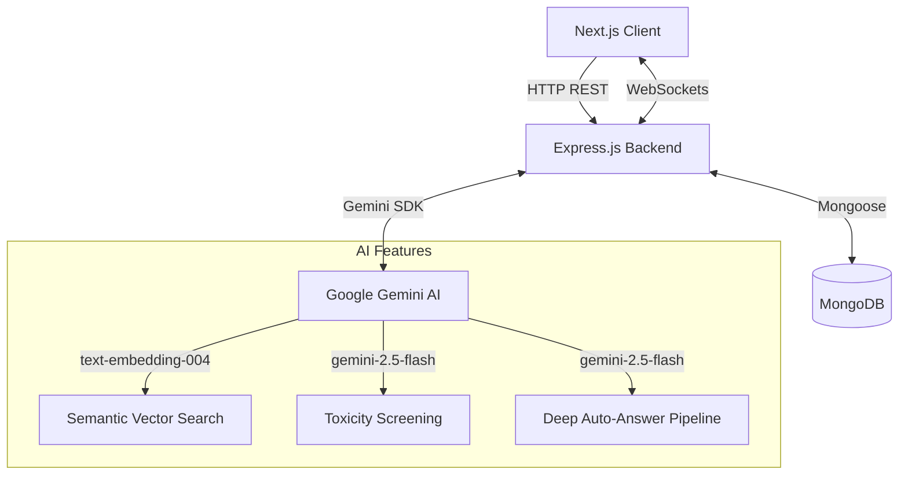
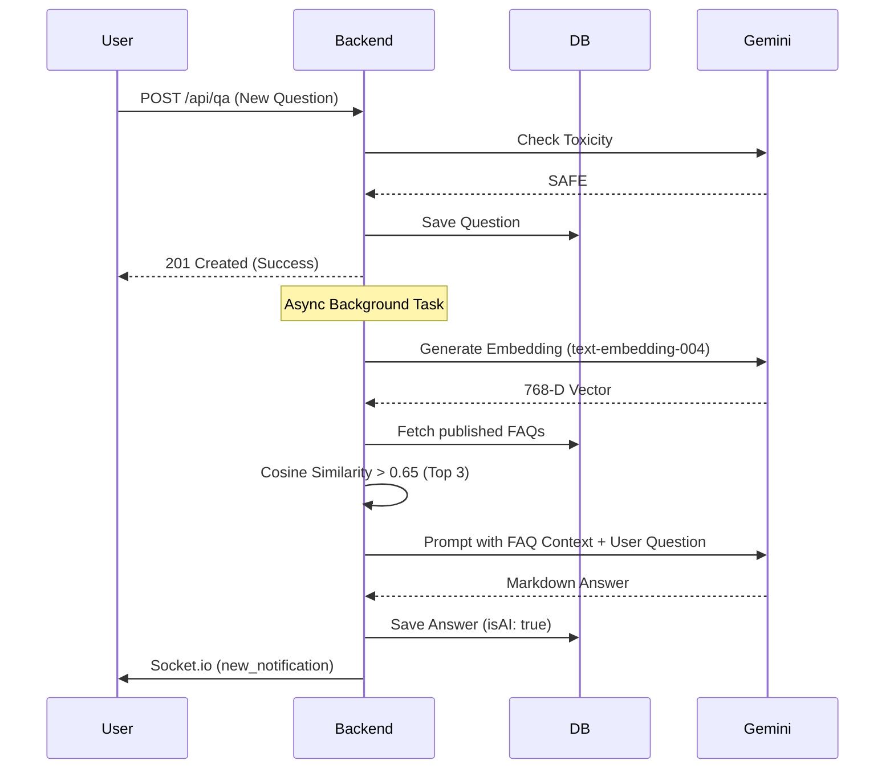

# Crowd Sourcing FAQ Project Report

## 1. Title Page
**Project Name:** Samagama FAQ & Crowdsourcing Platform  
**Repository Name:** faq  
**Repository Link:** [https://github.com/ABHISHEK27Y/faq.git](https://github.com/ABHISHEK27Y/faq.git)  
**Team List:** Abhishek (And Antigravity AI Assistant)  

---

## 2. Executive Summary
The Samagama FAQ & Crowdsourcing Platform is an advanced, AI-powered knowledge management system built to handle institutional and community inquiries dynamically. Traditional FAQ systems suffer from keyword matching limitations and quickly become outdated. This project solves those problems by integrating a Semantic Vector Search (Intent Engine) that understands the meaning behind user queries, and a "Deep Auto-Answer Pipeline" (Yaksha Bot) that uses Retrieval-Augmented Generation (RAG) to answer questions instantly. With robust real-time features, automated AI toxicity moderation, and a gamified reputation engine, the platform transforms static documentation into a thriving, self-sustaining community hub.

---

## 3. Introduction
In large educational or corporate environments, users repeatedly ask the same questions (e.g., about stipends, NOCs, or hostel policies). Manually managing these inquiries is time-consuming. The objective of this project was to develop a full-stack MERN application that serves both as an authoritative FAQ board and an interactive, StackOverflow-style Community Q&A platform. By leveraging Google's Gemini AI models for semantic search and content moderation, the platform guarantees that users find accurate answers instantly while keeping the community safe from abusive content.

---

## 4. System Design / Architecture & Diagrams

### 4.1 High-Level Architecture
The application follows a modern client-server architecture utilizing the MERN stack with Next.js on the frontend. Real-time updates are pushed via WebSockets (Socket.io).



### 4.2 Use-Case Diagram
```mermaid
flowchart LR
    User([Standard User])
    Admin([Administrator])
    Yaksha([Yaksha AI Bot])

    User --> (Search FAQs Semantically)
    User --> (Ask Questions)
    User --> (Answer Questions)
    User --> (Upvote / Downvote)
    
    Admin --> (Approve / Reject FAQs)
    Admin --> (View Telemetry)

    Yaksha --> (Auto-Moderate Content)
    Yaksha --> (Auto-Answer Questions)
```

### 4.3 Dataflow: Deep Auto-Answer Pipeline (RAG)


---

## 5. Implementation

### 5.1 Tech Stack & Justification
- **Frontend (Next.js 14+ / React)**: Used for Server-Side Rendering (SSR) and App Router capabilities, ensuring fast load times, excellent SEO, and robust client-side interactivity.
- **Styling (Tailwind CSS v4)**: Selected for highly customizable, utility-first styling, enabling responsive and beautifully animated UI components.
- **Backend (Node.js / Express.js)**: Chosen for its non-blocking, event-driven architecture, making it perfect for handling concurrent API requests and WebSocket connections.
- **Database (MongoDB / Mongoose)**: A NoSQL document database allows for highly flexible schemas, particularly useful for nested Q&A threads (Questions -> Answers -> Comments) and storing complex 768-D Float arrays for vector embeddings.
- **AI Models (Google Gemini)**: Gemini `text-embedding-004` is used for high-dimensional vector search, while `gemini-2.5-flash` is utilized for low-latency auto-answering and toxicity screening.
- **Real-Time (Socket.io)**: Implemented to establish persistent, bidirectional communication for live typing indicators and instant notifications without HTTP polling.

### 5.2 Module / Feature Breakdown
1. **Authentication Module**: Dual-strategy login supporting both traditional Email/Password (secured via bcryptjs and JWTs) and Google OAuth 2.0.
2. **FAQ Management Module**: Allows Admins to review user-proposed FAQs, approve/reject them, and automatically backfill semantic embeddings.
3. **Community Q&A Module**: The Reddit/StackOverflow-style hub where users ask bespoke questions. Includes nested comments, view-count tracking, and a hierarchical structure.
4. **Reputation Engine**: A gamified system where users gain points for upvotes (+10) and accepted answers (+20), complete with idempotency guards to prevent vote manipulation.
5. **AI Pipeline Module**: Houses the Toxicity Screening, Semantic Vector Search, and Yaksha Auto-Answer logic.

---

## 6. Feature Spotlight

*Note: The following sections require short screen-recorded GIF/Video demos. Please insert the links in the placeholders below.*

### 6.1 Semantic Vector Search (Intent Engine)
**Purpose & Impact**: Traditional keyword search fails when users use synonyms. This feature converts queries into mathematical vectors, returning results based on meaning rather than exact text matching. It drastically reduces duplicate inquiries.
**Demo**: *[Demo recorded and submitted separately]*

### 6.2 Deep Auto-Answer Pipeline (Yaksha Bot)
**Purpose & Impact**: Users get instant help. When a user posts a question, the system uses Retrieval-Augmented Generation (RAG) to instantly post an accurate answer using the verified FAQ database, displaying a special ✨ Yaksha Bot badge.
**Demo**: *[Demo recorded and submitted separately]*

### 6.3 AI Toxicity Screening
**Purpose & Impact**: Protects the community from abusive or inappropriate content asynchronously. The Gen-AI model evaluates text payloads instantly, rejecting toxic submissions before they ever hit the database.
**Demo**: *[Demo recorded and submitted separately]*

### 6.4 Real-Time Socket Interactions
**Purpose & Impact**: Makes the platform feel alive. Users see "User is typing..." indicators and receive slide-in toast notifications when their answers are accepted or commented on, driving engagement.
**Demo**: *[Demo recorded and submitted separately]*

### 6.5 Gamified Reputation & Leaderboards
**Purpose & Impact**: Incentivizes high-quality contributions. The animated leaderboard and visually distinct user badges turn knowledge sharing into a rewarding, gamified experience.
**Demo**: *[Demo recorded and submitted separately]*

---

## 7. Challenges & Limitations
- **Latency in Vector Generation**: Integrating with external AI APIs introduced network latency. **Solution**: We shifted the Auto-Answer pipeline to a non-blocking background task, allowing the user's initial post to resolve instantly.
- **Idempotency in Voting**: Preventing users from refreshing and upvoting multiple times. **Solution**: We implemented strict array-based tracking in MongoDB to ensure a user ID can only exist once in the `upvotes` array.
- **Limitation**: The Semantic Search currently stores embeddings in standard MongoDB arrays. While fast for a small to medium dataset, it may require a dedicated Vector Database (like Pinecone or MongoDB Atlas Vector Search) if the dataset grows to millions of FAQs.

---

## 8. Future Enhancements
- **Multi-lingual Support**: Automatically translate incoming questions and outgoing answers into regional Indian languages to improve accessibility.
- **Media Support**: Allow users to attach images or PDFs to their questions.
- **Admin Analytics Dashboard**: Implement complex data visualization (charts/graphs) to show search trends and identify gaps in the Knowledge Base based on failed search queries.

---

## 9. Conclusion
The Samagama FAQ & Crowdsourcing Platform successfully modernizes the traditional approach to institutional knowledge management. By blending the engagement of a StackOverflow-style community with the immense power of Generative AI (Semantic Search and RAG Auto-Answering), the platform achieves its goal of providing instant, accurate, and safe information retrieval. The robust tech stack and highly interactive UI guarantee an exceptional user experience, making it a highly scalable solution for the future.
